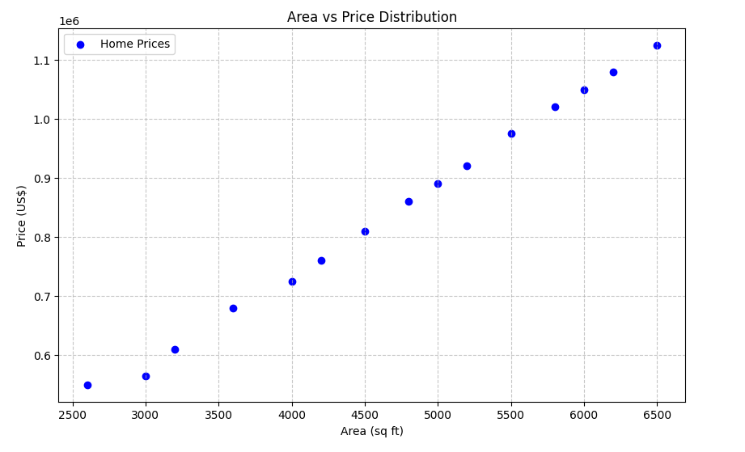
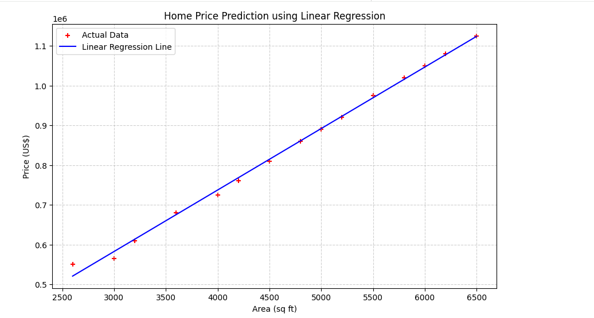
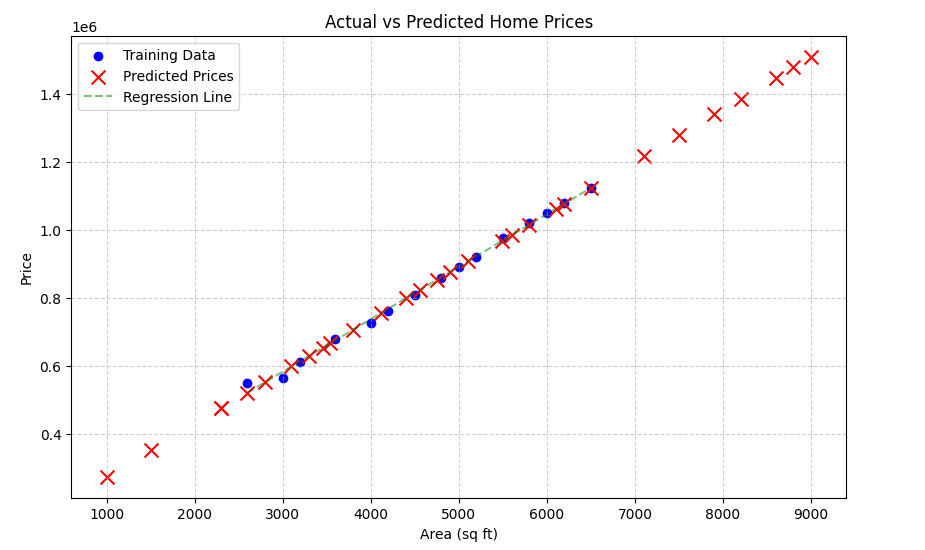

# Linear Regression - Home Price Prediction

This project implements a **Linear Regression** model to predict home prices based on their area (in square feet). It uses scikit-learn for model training and demonstrates the complete machine learning workflow from data exploration to predictions.

## Project Overview

The goal of this project is to build a predictive model that can estimate home prices given the area of a property. This is a classic supervised learning problem using simple linear regression.

## Dataset

The project uses two datasets:

- **homeprices.csv**: Training dataset containing home areas and their corresponding prices
- **areas.csv**: Test dataset containing areas for which we want to predict prices

### Data Sample

| Area (sq ft) | Price (US$) |
|--------------|-------------|
| 2600         | 550000      |
| 3000         | 565000      |
| 3200         | 610000      |
| 3600         | 680000      |
| 4000         | 725000      |

## Workflow Steps

### Step 1: Import Libraries
The project uses the following Python libraries:
- `numpy`: Numerical computations
- `pandas`: Data manipulation and analysis
- `matplotlib`: Data visualization
- `scikit-learn`: Machine learning algorithms

### Step 2: Load and Explore Data

Data is imported from CSV files and visualized to understand the relationship between area and price.



*Figure 1: Distribution of home prices across different areas. The scatter plot shows a positive linear relationship between property area and price.*

### Step 3: Prepare Data

The feature matrix (X) containing areas is reshaped into a 2D array format required by scikit-learn, and the target variable (y) contains the corresponding prices.

```python
X = df[['area']]      # Features (2D array)
y = df['price']       # Target variable
```

### Step 4: Train the Model

A Linear Regression model is trained on the prepared data using the least squares method to find the best-fit line.

```python
model = LinearRegression()
model.fit(X, y)
```

### Step 5: Make Predictions

The trained model can now predict home prices for any given area. The regression line is plotted alongside the actual training data.



*Figure 2: Linear regression line fitted to the training data. The blue line represents the model's learned relationship between area and price.*

### Step 6: Test with New Data

The model is evaluated on a separate test dataset containing new areas. Predictions are generated for each area in the test set.



*Figure 3: Comparison of training data (blue points) and predictions on test data (red X marks). The dashed green line shows the regression line for reference.*

## Model Performance

The model generates predictions for the test dataset. Each area is mapped to a predicted price based on the learned linear relationship:

```
Predicted price for area 2500: $583,750.00
```

## Mathematical Concept

Linear Regression finds the line that minimizes the sum of squared errors (least squares method):

- **Equation**: y = mx + b
  - m = slope (rate of price change per sq ft)
  - b = intercept (base price)
  - y = predicted price
  - x = property area

## Files in This Project

- `linear_regression.py` - Main implementation script
- `homeprices.csv` - Training dataset
- `areas.csv` - Test dataset for predictions
- `README.md` - Documentation (this file)
- `images/` - Visualization outputs
  - `1-area-prices-distribution.png` - Training data scatter plot
  - `2-home-prices-prediction.png` - Regression line visualization
  - `3-actual-vs-predicted-home-prices.png` - Model evaluation on test data

## Libraries Used

- **scikit-learn**: For Linear Regression implementation
- **pandas**: For data handling and CSV operations
- **matplotlib**: For creating visualizations
- **numpy**: For numerical operations

---

**Author**: Emrul Hasan Emon  
**Last Updated**: April 28, 2026
