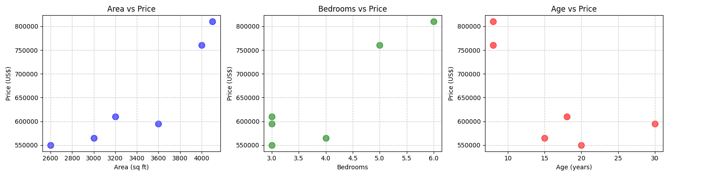
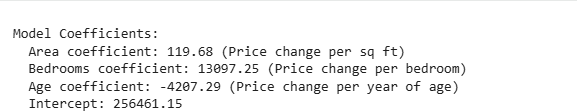
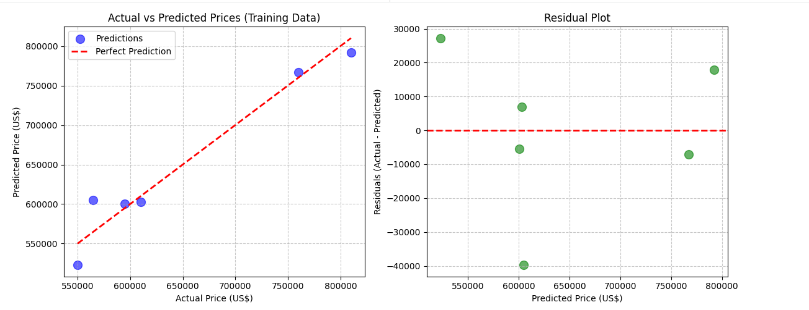

# Linear Regression — Multiple Variables (Home Price Prediction)

This project implements a **multiple-variable Linear Regression** model to predict home prices using three features: `area`, `bedrooms`, and `age`. It follows a complete supervised-learning workflow: data loading, exploration, training, evaluation, and prediction.

## Project Overview

The goal is to predict home price given the property features (area in sq ft, number of bedrooms, and age in years). Unlike the single-variable example, this model uses multiple features to better capture price variance.

## Datasets

- Training dataset: [datasets/homeprices_multiple_variables.csv](datasets/homeprices_multiple_variables.csv)
- Test dataset: [datasets/testing.csv](datasets/testing.csv)

### Training data sample
The training CSV contains rows with `area, bedrooms, age, price`.

## Files

- [linear_regression_multi_features.py](linear_regression_multi_features.py) — Main implementation and visualizations
- [datasets/homeprices_multiple_variables.csv](datasets/homeprices_multiple_variables.csv) — Training data
- [datasets/testing.csv](datasets/testing.csv) — Test data (used to generate predictions)
- `images/` — Visual outputs

## Mathematical Concept

Multivariate Linear Regression estimates the relationship between a dependent variable ($Y$) and two or more independent variables ($x$) by fitting a linear equation to observed data.

### The Equation
$$Y = w_1x_1 + w_2x_2 + w_3x_3 + b$$

**Where:**
*   **$Y$**: Predicted Price (Target)
*   **$x_1$**: Area (sq ft)
*   **$x_2$**: Number of Bedrooms
*   **$x_3$**: Age of the home
*   **$w_1, w_2, w_3$**: Coefficients (Weights) assigned to each feature by the model.
*   **$b$**: The Intercept (The base value when all features are zero).

The model uses **Ordinary Least Squares (OLS)** to find the optimal weights that minimize the difference between the actual prices and the prices predicted by the line.

---

## Technologies & Libraries

The project is built using the **Python** ecosystem with the following core libraries:

*   **Pandas**: For data manipulation and reading CSV files.
*   **NumPy**: For mathematical operations and handling multi-dimensional arrays.
*   **Scikit-Learn**: Specifically the `linear_model.LinearRegression` class for the machine learning implementation.
*   **Matplotlib**: For generating data distribution and error analysis graphs.

---

## Visualizations
The repository includes three images that illustrate the data and results:

## Make Predictions

Figure 1: Feature vs Price scatter plots

## Coefficients

Figure 2: Learned Feature coefficients

## Actual Vs Predicted and Error Plots

Actual vs Predicted and error plots

## Workflow Steps

### 1. Import Libraries
The script uses:
- `numpy` — numerical operations
- `pandas` — data handling
- `matplotlib` — plotting
- `scikit-learn` — `LinearRegression` and metrics

### 2. Load and Explore Data
Data is loaded from `datasets/homeprices_multiple_variables.csv`. The script prints a dataset preview, info, and summary statistics to help understand distributions.

### 3. Visualize Relationships
Scatter plots show how `area`, `bedrooms`, and `age` relate to `price`.

### 4. Prepare Features and Target
The feature matrix `X` contains `area, bedrooms, age` and the target `y` contains `price`.

### 5. Train the Model
A `LinearRegression` model is trained on the training dataset. After training the script prints coefficients and the intercept.

### 6. Evaluate the Model
The script reports training performance metrics: R² score and RMSE. It also creates:
- Actual vs Predicted scatter plot
- Residuals plot
- A combined performance figure showing R², RMSE, feature coefficients, and a prediction error histogram

### 7. Test / Predict
The script loads `datasets/testing.csv` and generates predictions for each row, printing inputs alongside predicted prices.

## Example Output
After running the script you will see lines similar to:

```
MODEL TRAINING COMPLETE
Model Coefficients:
  Area coefficient:  ...
  Bedrooms coefficient:  ...
  Age coefficient:  ...
  Intercept:  ...

Model Performance Metrics:
  R² Score: 0.xxxx
  Root Mean Squared Error (RMSE): $xxxxx.xx

Predicted Prices for Test Data:
   area  bedrooms  age  predicted_price
0  1000         1   12        123456.78
...
```

## Notes and Interpretation
- The printed coefficients indicate how much the price is expected to change per unit change in each feature (holding others constant).
- Use the R² score and RMSE to gauge overall fit — higher R² and lower RMSE are better.

---
**Author**: (adapted from single-variable README)
**Last Updated**: April 30, 2026
